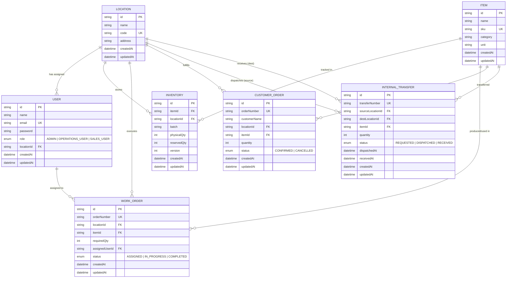

# Database Schema & Entity Relationship (ER) Documentation

## Mini Operations ERP Database Architecture

This document describes the relational database schema implemented using **PostgreSQL** and **Prisma ORM**.

---

## 1. Entity Relationship (ER) Diagram

---

## 2. Table Specifications & Constraints

### 2.1 `users`
Stores user credentials, role assignment, and optional warehouse location mapping.
* **`id`** (PK, string)
* **`email`** (Unique, indexed)
* **`role`** (Enum: `ADMIN`, `OPERATIONS_USER`, `SALES_USER`)
* **`locationId`** (FK $\rightarrow$ `locations.id`, `ON DELETE SET NULL`)

### 2.2 `locations`
Represents physical warehouses / operational branches.
* **`id`** (PK, string)
* **`code`** (Unique, e.g. `WH-01`, `WH-02`)

### 2.3 `items`
Catalog master for products and raw materials.
* **`id`** (PK, string)
* **`sku`** (Unique, e.g. `ITEM-STL-01`)

### 2.4 `inventories`
Tracks stock per item, per location, and per batch.
* **`id`** (PK, string)
* **`itemId`** (FK $\rightarrow$ `items.id`)
* **`locationId`** (FK $\rightarrow$ `locations.id`)
* **`batch`** (Batch identifier)
* **`physicalQty`** (Actual stock on floor)
* **`reservedQty`** (Stock committed to active customer orders)
* **`version`** (Integer for optimistic locking concurrency control)
* **Composite Unique Constraint**: `UNIQUE(itemId, locationId, batch)` prevents duplicate inventory buckets.

### 2.5 `work_orders`
Production/assembly jobs created by Admin.
* **`id`** (PK, string)
* **`orderNumber`** (Unique, e.g. `WO-1001`)
* **`status`** (`ASSIGNED` $\rightarrow$ `IN_PROGRESS` $\rightarrow$ `COMPLETED`)

### 2.6 `internal_transfers`
Inter-warehouse stock movements.
* **`id`** (PK, string)
* **`transferNumber`** (Unique, e.g. `TR-1001`)
* **`sourceLocationId`** (FK $\rightarrow$ `locations.id`)
* **`destLocationId`** (FK $\rightarrow$ `locations.id`)
* **`status`** (`REQUESTED` $\rightarrow$ `DISPATCHED` $\rightarrow$ `RECEIVED`)

### 2.7 `customer_orders`
Sales orders created by Sales Users.
* **`id`** (PK, string)
* **`orderNumber`** (Unique, e.g. `SO-1001`)
* **`status`** (`CONFIRMED` $\rightarrow$ `CANCELLED`)

---

## 3. Core Business Formulas & Rules

1. **Available Quantity Formula**:
   $$\text{Available Quantity} = \text{Physical Quantity} - \text{Reserved Quantity}$$

2. **Shortage Calculation Formula**:
   $$\text{Shortage} = \max(0, \text{Required Quantity} - \text{Available Quantity at Location})$$

3. **Stock Transfer Rules**:
   * **On Dispatch**: Source location physical inventory reduces immediately.
   * **In Transit**: Destination location physical inventory remains unchanged.
   * **On Receipt**: Destination location physical inventory increases. Status changes to `RECEIVED`. Cannot be received more than once.

4. **Stock Reservation & Concurrency Rule**:
   * Stock reservations are executed with database-level locking / atomic transactions to prevent overselling beyond `availableQty`.
